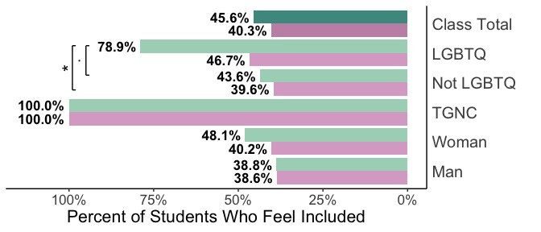
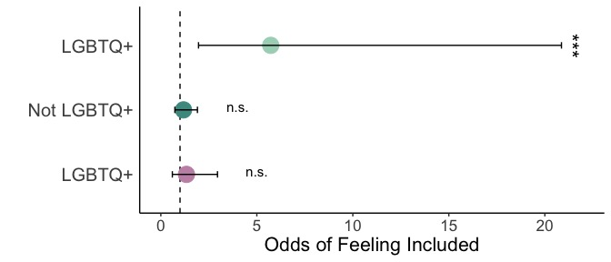

DivFirst Qualitative Data Analysis
================
Paula Adams
2025-03-06

- [Set-Up and Data](#set-up-and-data)
- [RQ1: Results](#rq1-results)
  - [Feel Included](#feel-included)
- [RQ2: Results](#rq2-results)
  - [Impact on Students](#impact-on-students)
- [RQ3: Results](#rq3-results)
  - [What students learned](#what-students-learned)
  - [How students define sex](#how-students-define-sex)
  - [How students define gender](#how-students-define-gender)
  - [How students define sex and gender
    figure](#how-students-define-sex-and-gender-figure)
  - [Difference between Sex and
    Gender](#difference-between-sex-and-gender)
- [RQ4: Results](#rq4-results)
  - [Naturalistic fallacy](#naturalistic-fallacy)

# Set-Up and Data

``` r
Q101 <- read.csv("Qualitative_Data/Q101_new.csv") #why did you feel included 
Q111 <- read.csv("Qualitative_Data/Q111_new.csv") #impact in course
Q97 <- read.csv("Qualitative_Data/Q97_new.csv") #what did you learn about sex and gender
Q102_gender <- read.csv("Qualitative_Data/Q102_gender_new.csv") #gender definition
Q102_sex <- read.csv("Qualitative_Data/Q102_sex_new.csv") #sex definition
Q102_difference <- read.csv("Qualitative_Data/Q102_difference_new.csv") #difference between sex and gender
Q107_nfal <-  read.csv("Qualitative_Data/Q107_new.csv")

# Make data subsets for Sex and Gender
Q102_sex %>% distinct(ResponseId, SimplifiedCategory, .keep_all = TRUE) -> Q102_sex_SimpleCategories
Q102_gender %>% distinct(ResponseId, SimplifiedCategory, .keep_all = TRUE) -> Q102_gen_SimpleCategories

Q102_sex %>% dplyr::select(ResponseId,Class_text,BaseCategory) %>% distinct(ResponseId, BaseCategory, .keep_all = TRUE)-> Q102_sex_BaseCategories 
Q102_gender %>% dplyr::select(ResponseId,Class_text,BaseCategory) %>% distinct(ResponseId, BaseCategory, .keep_all = TRUE)-> Q102_gen_BaseCategories 

Q102_sex_BaseCategories$BaseCategory <- factor(Q102_sex_BaseCategories$BaseCategory, levels=c('Biology Concepts', 'Biology & Gender Concepts','Gender Concepts',"Sex is an Identity"))
Q102_gen_BaseCategories$BaseCategory <- factor(Q102_gen_BaseCategories$BaseCategory, levels=c('Gender Concepts', 'Biology & Gender Concepts','Biology Concepts','Dismisses Question'))
```

# RQ1: Results

## Feel Included

Question: “You indicated that discussions of sex/gender made you feel
included in this class. Why did this make you feel included?”

``` r
#Student Counts
Q101_StudentCounts <- Q101 %>% distinct(ResponseId,.keep_all = TRUE) %>% count(Class_text)

#Summary
Q101_summary<- Q101%>% distinct(ResponseId, SimplifiedCategory, .keep_all = TRUE) %>% group_by(Class_text) %>% count(SimplifiedCategory) %>% pivot_wider(names_from = Class_text, values_from = n) #from summary section

## Summarize and Add percents for all categories in the cleaned dataset
Q101_summary %>% gather("Class","Value", 2:3) -> Q101_summary_new
Q101_summary_new %>% mutate(Percent=case_when(Class=="Traditional" ~ 100*(Value/64), Class=="Treatment" ~ 100*(Value/65))) -> Q101_summary_new_percents
Q101_summary_new_percents %>% pivot_wider(names_from="Class",values_from=c("Value","Percent"),values_fill=0) %>% data.frame -> Q101_summary_new_percents_wider 
 
#Remove categories less than 10 percent for both groups
Q101_summary_new_percents_wider %>% group_by(SimplifiedCategory) %>% subset((Percent_Traditional >= 10) | (Percent_Treatment >= 10)) -> Q101_summary_10_percents_wider
Q101_summary_10_percents_wider %>% pivot_longer(-c(SimplifiedCategory),
               names_to = c(".value", "Class_text"), 
               names_sep = "_") -> Q101_summary_10percent

Q101summary_bar <- ggplot(Q101_summary_10percent,aes(x=Percent/100,y=fct_rev(SimplifiedCategory),fill=(Class_text))) +
  geom_col(position="dodge") +
 #  geom_col(position="dodge",color="black") +
 scale_fill_manual(name = "Section", values = c(
    "Treatment" = "#AAD5C1FF",
    "Traditional"  = "#DBACCCFF" ))+
  theme_classic() + 
  xlab("Why Students Felt Included - Percent")+
  ylab("") +
  scale_y_discrete(labels=function(SimplifiedCategory) str_wrap(SimplifiedCategory,width=18))+
  scale_x_continuous(limits=c(0,.55),labels=label_percent(),breaks=c(0,.1,.2,.3,.4,.5)) +
#  ggtitle("Why Did You Feel Included?")+ 
      guides(fill = guide_legend(reverse = TRUE, title="Section"))+  
  theme(panel.grid = element_blank(),
        axis.ticks.y=element_blank(),
      #  plot.title=element_text(size=14, face="bold"),
        axis.text.y = element_text(size = 15),
        axis.text.x = element_text(size = 13),
        axis.title = element_text(size = 16),
        legend.title=element_text(size=15), 
        legend.text=element_text(size=14),
        legend.key.size = unit(.8, 'cm'))+
    geom_text(aes(label=percent(Percent/100, accuracy=.1),hjust=-.1), position=position_dodge(width=0.9),size=4.5,fontface="bold")
Q101summary_bar
```

<!-- -->

# RQ2: Results

## Impact on Students

Question: “The lecture on sexual diversity in the beginning of the
course had a positive/neutral/negative impact on my course experience”

``` r
#Student Counts
Q111_StudentCounts_group <- Q111 %>% distinct(ResponseId,.keep_all = TRUE) %>% count(Q110_Group_Simple)
Q111_StudentCounts_lgbtq <- Q111 %>% distinct(ResponseId,.keep_all = TRUE) %>% count(Q109_text,Q110_Group_Simple)

#Summaries
Q111_summary_group <- Q111 %>% distinct(ResponseId, Category, .keep_all = TRUE) %>% group_by(Q110_Group_Simple) %>% count(Category) 
Q111_summary_group_wide <- Q111_summary_group %>% pivot_wider(names_from = Q110_Group_Simple, values_from = c(n))
Q111_summary_lgbtq <- Q111 %>% distinct(ResponseId, Category, .keep_all = TRUE) %>% group_by(Q109_text) %>% count(Category) 

#Add Percents
Q111_summary_group %>% mutate(Percent=case_when(Q110_Group_Simple=="Negative" ~ 100*(n/15), Q110_Group_Simple=="No Impact" ~ 100*(n/68), Q110_Group_Simple=="Positive" ~ 100*(n/53))) -> Q111_summary_group_percents
Q111_summary_group_percents_wide <- Q111_summary_group_percents %>% pivot_wider(names_from = Q110_Group_Simple, values_from = c(n,Percent))
subset(Q111_summary_lgbtq,Q109_text=="LGBTQ") %>% mutate(Percent=100*(n/14)) -> Q111_summary_lgbtq_percents
```

# RQ3: Results

## What students learned

Question: “In this organismal biology class, what did you learn about
sex and gender?”

``` r
#Student Counts
Q97_StudentCounts <- Q97 %>% distinct(ResponseId,.keep_all = TRUE) %>% count(Class_text)

#Summary Subcategory
Q97_summary_subcategories <- Q97 %>% distinct(ResponseId, Category, .keep_all = TRUE) %>% group_by(Class_text,SimplifiedCategory) %>%count(Category) 
Q97_percents_subcategory <- Q97_summary_subcategories %>% mutate(Percent=case_when(Class_text=="Traditional" ~ 100*(n/157), Class_text=="Treatment" ~ 100*(n/139))) 
Q97_percents_subcategory_wide <- Q97_percents_subcategory %>% pivot_wider(names_from = Class_text, values_from = c(n,Percent))

#Summary Simplified Category
Q97_summary_SimplifiedCategory <- Q97 %>% distinct(ResponseId, SimplifiedCategory, .keep_all = TRUE) %>% group_by(Class_text) %>%count(SimplifiedCategory) 
Q97_percents_SimplifiedCategory <- Q97_summary_SimplifiedCategory %>% mutate(Percent=case_when(Class_text=="Traditional" ~ 100*(n/157), Class_text=="Treatment" ~ 100*(n/139))) 
Q97_percents_SimplifiedCategory_wide <- Q97_percents_SimplifiedCategory %>% pivot_wider(names_from = Class_text, values_from = c(n,Percent))

#Remove categories less than 10 percent for both groups
Q97_percents_SimplifiedCategory_wide %>% group_by(SimplifiedCategory) %>% subset((Percent_Traditional >= 10) | (Percent_Treatment >= 10)) -> Q97_10percent_wider
Q97_10percent_wider %>% pivot_longer(-c(SimplifiedCategory),
               names_to = c(".value", "Class_text"), 
               names_sep = "_") -> Q97_10percent

# Supplemental Figure 1
Q97_summary_bar_10percent <- ggplot(Q97_10percent,aes(x=Percent/100,y=fct_rev(SimplifiedCategory),fill=fct_rev(Class_text))) +
  geom_col(position=position_dodge(preserve = "single")) +
   scale_fill_manual(name = "Section", values = c(
    "Treatment" = "#AAD5C1FF",
    "Traditional"  = "#DBACCCFF" ))+
  scale_y_discrete(labels=function(SimplifiedCategory) str_wrap(SimplifiedCategory,width=11))+  
  scale_x_continuous(limits=c(0, .73),labels=label_percent(),breaks=c(0,.1,.2,.3,.4,.5,.6,.7)) +
 theme_classic() + 
  theme(panel.grid = element_blank(),
         axis.ticks.y=element_blank(),
         axis.text.y = element_text(size = 16),
        axis.text.x = element_text(size = 14),
        axis.title = element_text(size = 16),
        legend.title=element_text(size=16), 
        legend.text=element_text(size=14),
        plot.title=element_text(size=17, face="bold"),
        legend.key.size = unit(.8, 'cm'))+ 
  xlab("Percent of Students")+
  ylab("") +
  ggtitle("What Students Learned About Sex and Gender")+
      guides(fill = guide_legend(reverse = TRUE, title="Section"))+    
  geom_text(aes(label=percent(Percent/100, accuracy=.1),hjust=-.1), position=position_dodge(width=0.9),size=4.5,fontface="bold")
Q97_summary_bar_10percent
```

<!-- -->

## How students define sex

``` r
#Student Counts
Q102s_StudentCounts <- Q102_sex %>% distinct(ResponseId,.keep_all = TRUE) %>% count(Class_text)

#Summary For all Categories - Supplemental Table S8
Q102_sex_summary <- Q102_sex %>% distinct(ResponseId, Category, .keep_all = TRUE)%>% group_by(Class_text,SimplifiedCategory) %>% count(Category) %>% pivot_wider(names_from = Class_text, values_from = n)
Q102_sex_summary %>% gather("Class_text","n", 3:4) -> Q102_sex_summary_new
Q102_sex_percents <- mutate(Q102_sex_summary_new, Percent = case_when(Class_text=="Traditional" ~ 100*(n/Q102s_StudentCounts$n[1]), Class_text=="Treatment" ~ 100*(n/(Q102s_StudentCounts$n[2])))) ## Add percent of students using the number of students in each class
Q102_sex_percents %>% pivot_wider(names_from="Class_text",values_from=c("n","Percent"),values_fill=0) %>% data.frame -> Q102_sex_percents_wider 

# Summary For Simplified Categories 
Q102_sex_summary_SimplifiedCatgegory <- Q102_sex_SimpleCategories %>% distinct(ResponseId, SimplifiedCategory, .keep_all = TRUE) %>% group_by(Class_text) %>% count(SimplifiedCategory)
Q102_sex_percents_SimplifiedCategory <- mutate(Q102_sex_summary_SimplifiedCatgegory, Percent = case_when(Class_text=="Traditional" ~ 100*(n/Q102s_StudentCounts$n[1]), Class_text=="Treatment" ~ 100*(n/(Q102s_StudentCounts$n[2])))) ## Add percent of students using the number of students in each class
Q102_sex_percents_SimplifiedCategory %>% pivot_wider(names_from="Class_text",values_from=c("n","Percent"),values_fill=0) %>% data.frame -> Q102_sex_percents_SimplifiedCategory_wider 

## Summarize and Add percents for BaseCategory dataset
Q102_sex_summary_BaseCategory <- Q102_sex_BaseCategories %>% distinct(ResponseId, BaseCategory, .keep_all = TRUE) %>% group_by(Class_text) %>% count(BaseCategory)
Q102_sex_percents_BaseCategory <- mutate(Q102_sex_summary_BaseCategory, Percent = case_when(Class_text=="Traditional" ~ 100*(n/Q102s_StudentCounts$n[1]), Class_text=="Treatment" ~ 100*(n/(Q102s_StudentCounts$n[2])))) ## Add percent of students using the number of students in each class
Q102_sex_percents_BaseCategory %>% pivot_wider(names_from="Class_text",values_from=c("n","Percent"),values_fill=0) %>% data.frame -> Q102_sex_percents_BaseCategory_wider 

Q102_sex_percents_BaseCategory$BaseCategory <- factor(Q102_sex_percents_BaseCategory$BaseCategory, levels=c('Sex is an Identity', 'Gender Concepts','Biology & Gender Concepts','Biology Concepts'))

#Remove categories less than 5 percent for both groups
Q102_sex_percents_wider %>% group_by(SimplifiedCategory,Category) %>% subset((Percent_Traditional >= 5) | (Percent_Treatment >= 5)) %>% replace(is.na(.), 0)-> Q102_sex_5percents_wider
Q102_sex_5percents_wider %>% pivot_longer(-c(SimplifiedCategory,Category),
               names_to = c(".value", "Class_text"), 
               names_sep = "_") -> Q102_sex_percents_5  
```

## How students define gender

``` r
#Student Counts
Q102g_StudentCounts <- Q102_gender %>% distinct(ResponseId,.keep_all = TRUE) %>% count(Class_text)

#Summary For all Categories - Supplemental Table S9
Q102_gen_summary <- Q102_gender %>% distinct(ResponseId, Category, .keep_all = TRUE) %>% group_by(Class_text,SimplifiedCategory) %>% count(Category) %>% pivot_wider(names_from = Class_text, values_from = n)
Q102_gen_summary %>% gather("Class","Value", 3:4) -> Q102_gen_summary_new
Q102_gen_percents <- mutate(Q102_gen_summary_new, Percent = case_when(Class=="Traditional" ~ 100*(Value/Q102g_StudentCounts$n[1]), Class=="Treatment" ~ 100*(Value/(Q102g_StudentCounts$n[2])))) ## Add percent of students using the number of students in each class
Q102_gen_percents %>% pivot_wider(names_from="Class",values_from=c("Value","Percent"),values_fill=0) %>% data.frame -> Q102_gen_percents_wider 

# Summary For Simplified Categories 
Q102_gen_summary_SimplifiedCategory <- Q102_gender %>% distinct(ResponseId, SimplifiedCategory, .keep_all = TRUE) %>% group_by(Class_text) %>% count(SimplifiedCategory) 
Q102_gen_percents_SimplifiedCategory <- mutate(Q102_gen_summary_SimplifiedCategory, Percent = case_when(Class_text=="Traditional" ~ 100*(n/Q102g_StudentCounts$n[1]), Class_text=="Treatment" ~ 100*(n/(Q102g_StudentCounts$n[2])))) ## Add percent of students using the number of students in each class
Q102_gen_percents_SimplifiedCategory$SimplifiedCategory <- factor(Q102_gen_percents_SimplifiedCategory$SimplifiedCategory, levels=c('Gender', 'Sex','Sex_orientation','Dismiss',"DontKnow"))
Q102_gen_percents_SimplifiedCategory %>% pivot_wider(names_from="Class_text",values_from=c("n","Percent"),values_fill=0) %>% data.frame -> Q102_gen_percents_SimplifiedCategory_wider 

## Summarize and Add percents for BaseCategory dataset
Q102_gen_summary_BaseCategory <- Q102_gen_BaseCategories %>% distinct(ResponseId, BaseCategory, .keep_all = TRUE) %>% group_by(Class_text) %>% count(BaseCategory)
Q102_gen_summary_BaseCategory %>% drop_na(BaseCategory) -> Q102_gen_summary_BaseCategory # remove missing category
Q102_gen_percents_BaseCategory <- mutate(Q102_gen_summary_BaseCategory, Percent = case_when(Class_text=="Traditional" ~ 100*(n/Q102g_StudentCounts$n[1]), Class_text=="Treatment" ~ 100*(n/(Q102g_StudentCounts$n[2]-1)))) ## Add percent of students using the number of students in each class
Q102_gen_percents_BaseCategory %>% pivot_wider(names_from="Class_text",values_from=c("n","Percent"),values_fill=0) %>% data.frame -> Q102_gen_percents_BaseCategory_wider 


#Remove categories less than 5 percent for both groups
Q102_gen_percents_wider %>% group_by(SimplifiedCategory,Category) %>% subset((Percent_Traditional >= 5) | (Percent_Treatment >= 5)) -> Q102_gen_5percents_wider
Q102_gen_5percents_wider %>% pivot_longer(-c(SimplifiedCategory,Category),
               names_to = c(".value", "Class_text"), 
               names_sep = "_") -> Q102_gen_percents_5  


Q102_gen_percents_BaseCategory$BaseCategory <- factor(Q102_gen_percents_BaseCategory$BaseCategory, levels=c('Dismisses Question', 'Biology Concepts','Biology & Gender Concepts','Gender Concepts'))
Q102_gen_percents_SimplifiedCategory$SimplifiedCategory <- factor(Q102_gen_percents_SimplifiedCategory$SimplifiedCategory, levels=c('Gender', 'Sex','Sex_orientation','Dismiss',"DontKnow"))


Q102_gen_percents_BaseCategory %>% mutate(BaseCategory = fct_recode(as.factor(BaseCategory),"Other Answers"="Dismisses Question")) -> Q102_gen_percents_BaseCategory
```

``` r
Q102sex_bar5percent_facet <- ggplot(Q102_sex_percents_5,aes(x=Percent/100,y=fct_rev(Category),fill=(fct_rev(Category)))) +
  geom_col(alpha=0.7,position=position_dodge(preserve = "single"),color="black") +
     scale_fill_manual(values = c("#631879","#008280","#008280","#008280","#008280","#008280","#008280","#008280"))+
  facet_wrap(~Class_text)+
  xlab("Percent")+
  ylab("") +
  scale_x_continuous(limits=c(0, .75),breaks=c(0,.25,.5,.75),labels=label_percent())+
  scale_y_discrete(name = "Category")+
  ggtitle("Sex Definition Subcategories")+
  theme_cowplot() + 
  theme(axis.text.y = element_text(size = 8),
        axis.title.y = element_text(size=12),
        axis.text.x = element_text(size = 8),
        axis.title.x = element_text(size=11),
        plot.title=element_text(size=11, face="bold"),
        legend.position = "none",
        plot.margin = margin(l=0,r=5,t=0,b=0),
        axis.line=element_blank(),
        panel.border = element_rect(color="black",linewidth = 1),
        strip.background =element_rect(fill="#EAEBEB")) +
        #strip.background =element_blank()) +
 geom_text(aes(label=percent(Percent/100, accuracy=.1),hjust=-.1), position=position_dodge(width=0.9),size=2.5,fontface="bold") 

Q102s_basecategory_bar <- ggplot(Q102_sex_percents_BaseCategory,
                    aes(y=Class_text,x=Percent/100,fill=BaseCategory,pattern=BaseCategory)) + 
  geom_bar_pattern(alpha=0.7,stat="identity", pattern_fill="#008280", pattern_color="#008280",pattern_density=0.3,color="black") +
   scale_fill_manual(name = "Category", values = c(
     "Biology Concepts" = "#008280",
     "Biology & Gender Concepts"  = "#631879",
     "Gender Concepts" = "#631879",
     "Sex is an Identity" = "gray"
       ))+
  scale_pattern_manual(
    name = "Category",
    values = c(
      "Biology Concepts" = "none",
      "Biology & Gender Concepts" = "stripe", 
      "Gender Concepts" = "none",
      "Sex is an Identity" = "none"
    ))+
  scale_y_discrete(name = "Curriculum")+
  scale_x_continuous(limits=c(0, 1),breaks=c(0,.25,.5,.75,1),labels=label_percent(),name="Percent")+ #,expand = expansion(mult = c(0.01, 0.05))) +
  theme_cowplot()+
  ggtitle("How Do Students Define Sex?") +
  theme(axis.text.y = element_text(size = 12),
        axis.title.y = element_text(size=12),
        axis.text.x = element_text(size = 12),
        axis.title.x = element_text(size=12),
        plot.title=element_text(size=12, face="bold"))

Q102gen_bar5percentfacet <- ggplot(Q102_gen_percents_5,aes(x=Percent/100,y=fct_rev(Category),fill=(fct_rev(Category)))) +
  geom_col(alpha=0.7,position=position_dodge(preserve = "single"),color="black") +
     scale_fill_manual(values = c("#008280","#008280","#008280","#008280","#631879","#631879","#631879","#631879","#631879","#631879"))+
  xlab("Percent")+
  ylab("") +
  scale_x_continuous(limits=c(0, .7),breaks=c(0,.25,.5),labels=label_percent())+
  scale_y_discrete(labels=function(Category) str_wrap(Category,width=26))+
  ggtitle("Gender Definition Subcategories")+
  theme_cowplot() + 
  theme(axis.text.y = element_text(size = 8),
        axis.title.y = element_text(size=12),
        axis.text.x = element_text(size = 8),
        axis.title.x = element_text(size=11),
        plot.title=element_text(size=11, face="bold"),
        legend.position = "none",
        plot.margin = margin(l=0,t=0,b=0,r=5),
        axis.line=element_blank(),
        panel.border = element_rect(color="black",linewidth = 1),
        strip.background =element_rect(fill="#EAEBEB")) +
  facet_wrap(~Class_text)+
  geom_text(aes(label=percent(Percent/100, accuracy=.1),hjust=-.1),
            position=position_dodge(width=0.9),size=2.7,fontface="bold")

Q102g_basecategory_bar <- ggplot(Q102_gen_percents_BaseCategory,
                    aes(y=Class_text,x=Percent/100,fill=BaseCategory,pattern=BaseCategory)) + 
  geom_bar_pattern(alpha=0.7,stat="identity",
                   pattern_fill="#008280", pattern_color="#008280",pattern_density=0.3,color="black") +
   scale_fill_manual(name = "Category", values = c(
     "Biology Concepts" = "#008280",
     "Biology & Gender Concepts"  = "#631879",
     "Gender Concepts" = "#631879",
     "Other Answers"  = "gray"),
     breaks=c("Biology Concepts","Biology & Gender Concepts","Gender Concepts","Other Answers"))+
  scale_pattern_manual(
    name = "Category",
    values = c(
      "Biology Concepts" = "none",
      "Biology & Gender Concepts" = "stripe", 
      "Gender Concepts" = "none",
      "Other Answers" = "none"),
      breaks=c("Biology Concepts","Biology & Gender Concepts","Gender Concepts","Other Answers"))+
  scale_y_discrete(name = "")+
  scale_x_continuous(limits=c(0, 1),breaks=c(0,.25,.5,.75,1),labels=label_percent(),name="Percent")+
  theme_cowplot()+ 
  ggtitle("How Do Students Define Gender?") +
  theme(axis.text.y = element_text(size = 12),
        axis.title.y = element_text(size=12),
        axis.text.x = element_text(size = 12),
        axis.title.x = element_text(size=12),
        plot.title=element_text(size=12, face="bold"),
        legend.text=element_text(size=7),
        legend.title=element_text(size=8),
        legend.direction = "horizontal",
        legend.position = "bottom",
        legend.key.size=unit(.8,'cm')) 
```

## How students define sex and gender figure

``` r
Q102s_basecategory_barnew <- Q102s_basecategory_bar + theme(legend.position='none')

genderlegend <- get_legend(Q102g_basecategory_bar)
```

    ## Warning in get_plot_component(plot, "guide-box"): Multiple components found;
    ## returning the first one. To return all, use `return_all = TRUE`.

``` r
genderlegend <- get_plot_component(Q102g_basecategory_bar, 'guide-box-bottom',return_all=TRUE)
Q102g_basecategory_barnew <- Q102g_basecategory_bar + theme(legend.position='none')

plot_grid(Q102s_basecategory_barnew,Q102g_basecategory_barnew,ncol=2,labels = c('A', 'B'),scale=0.95,label_size=18,label_x=.025) -> definitionsbarchart_new
plot_grid(Q102sex_bar5percent_facet,Q102gen_bar5percentfacet,labels = c('C', 'D'),scale=0.95,label_size=18,label_x=.025) -> sub_definitionsbarchart
plot_grid(definitionsbarchart_new,sub_definitionsbarchart,ncol=1,rel_heights = c(.6,1)) -> combo_new
plot_grid(NULL,genderlegend,NULL,ncol=3,rel_widths = c(.6,1,1)) -> genderlegend2
plot_grid(combo_new,genderlegend2,ncol=1,rel_heights =c(1,.1)) -> definitions_figure
definitions_figure
```

<!-- -->

## Difference between Sex and Gender

``` r
#Student Count
Q102diff_StudentCounts <- Q102_difference %>% distinct(ResponseId,.keep_all = TRUE) %>% count(Class_text)

#Summary 
Q102_difference_summary <- Q102_difference %>% distinct(ResponseId, SimplifiedCategory, .keep_all = TRUE) %>% group_by(Class_text) %>% count(SimplifiedCategory)
Q102_difference_percents <- mutate(Q102_difference_summary, Percent = case_when(Class_text=="Traditional" ~ 100*(n/Q102diff_StudentCounts$n[1]), Class_text=="Treatment" ~ 100*(n/Q102diff_StudentCounts$n[2]))) 
Q102_difference_percents %>% pivot_wider(names_from="Class_text",values_from=c("n","Percent"),values_fill=0) %>% data.frame -> Q102_difference_percents_wider 

Q102_difference_percents$SimplifiedCategory <- factor(Q102_difference_percents$SimplifiedCategory, levels=c('Unsure/Don\'t Know', 'Same','Different'))

Q102_differences_barchart <- ggplot(Q102_difference_percents,
                    aes(y=Class_text,x=Percent,fill=SimplifiedCategory)) + 
  geom_bar(alpha=0.7,stat="identity",color="black") +
   scale_fill_manual(name = "Category", values = c(
     "Same" = "#008280",
     "Different"  = "#631879",
     "Unsure/Don't Know" = "gray"
       ))+
  ggtitle("Is there a difference between Sex and Gender?") +
  scale_y_discrete(name = "Curriculum") +
  scale_x_continuous(name = "") +
    theme_classic() + 
  theme(axis.text.y = element_text(size = 10),
        axis.title.y = element_text(size=10),
        plot.title=element_text(size=10, face="bold")) +
  guides(fill = guide_legend(reverse = TRUE, title="Definition Category"))

Q102_differences_barchart
```

<!-- -->

# RQ4: Results

## Naturalistic fallacy

Question: “Should we draw conclusions about what is ethical/moral in
human societies based on how (non-human) animals act? Please explain
your answer with an example.”

``` r
Q107_nfal_StudentCounts <- Q107_nfal %>% distinct(ResponseId,.keep_all=TRUE) %>% count(Class_text)
Q107_nfal_summary <- Q107_nfal %>% group_by(Class_text) %>% count(Category) %>% pivot_wider(names_from=Class_text,values_from=n)


Q107_nfal_summary %>% gather("Class_text","n", 2:3) -> Q107_nfal_summary_new
Q107_nfal_percents <- mutate(Q107_nfal_summary_new, Percent = case_when(Class_text=="Traditional" ~ 100*(n/Q107_nfal_StudentCounts$n[2]), Class_text=="Treatment" ~ 100*(n/Q107_nfal_StudentCounts$n[1]))) ## Add percent of students using the number of students in each class
Q107_nfal_percents %>% pivot_wider(names_from="Class_text",values_from=c("n","Percent"),values_fill=0) %>% data.frame -> Q107_nfal_percents_wider 


Q107_nfal_bar <- ggplot(Q107_nfal_percents,aes(x=Percent/100,y=fct_rev(Category),fill=fct_rev(Class_text))) +
  geom_col(position=position_dodge(preserve = "single")) +
   scale_fill_manual(name = "Section", values = c(
    "Treatment" = "#AAD5C1FF",
    "Traditional"  = "#DBACCCFF" ))+
  scale_y_discrete(labels=function(Category) str_wrap(Category,width=20))+  
  scale_x_continuous(limits=c(0, 1),labels=label_percent(),breaks=c(0,.1,.2,.3,.4,.5,.6,.7,.8,.9,1)) +
 theme_classic() + 
  theme(panel.grid = element_blank(),
         axis.ticks.y=element_blank(),
         axis.text.y = element_text(size = 10),
        axis.text.x = element_text(size = 10),
        axis.title = element_text(size = 16),
        legend.title=element_text(size=15), 
        legend.text=element_text(size=14),
        legend.key.size = unit(.8, 'cm'))+ 
  xlab("Percent of Students")+
  ylab("") +
  ggtitle(str_wrap("Should we draw conclusions about what is ethical for human societies based on how non-human animals act?",width=50))+
      guides(fill = guide_legend(reverse = TRUE, title="Section"))+    
  geom_text(aes(label=percent(Percent/100, accuracy=.1),hjust=-.1), position=position_dodge(width=0.9),size=4.5,fontface="bold")
Q107_nfal_bar
```

<!-- -->
